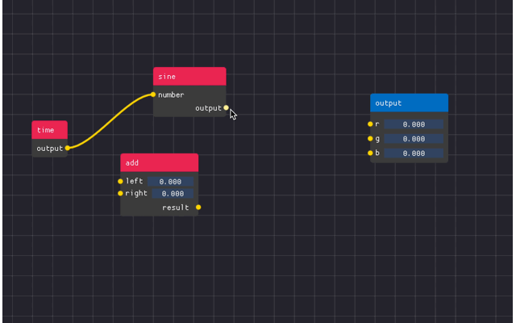

# ImNodes

A small, dependency-free node editor extension for [Dear ImGUI](https://github.com/ocornut/imgui).



ImNodes aims to provide a simple, immediate-mode interface for creating a node editor Dear ImGUI.

Features:

* Create nodes, links, and pins.
* Nest Dear ImGUI widgets inside nodes.
* To integrate either copy-paste the contents of the `src/` into your project.
* Or use as a **CMake module**.

## Usage

ImNodes can be used as CMake module, for example with `FetchContent`.

```cmake
include(FetchContent)
FetchContent_Declare(
  imnodes
  GIT_REPOSITORY "https://github.com/MartinHelmut/imnodes.git"
  GIT_TAG v1.0.0
)
FetchContent_MakeAvailable(imnodes)
```

And link it to your target together with Dear ImGUI.

```cmake
target_link_libraries(SomeAppTarget PRIVATE imgui imnodes)
```

Initialize the library together with Dear ImGUI.

```cpp
ImGui::CreateContext();
ImNodes::CreateContext();

// ...

ImNodes::DestroyContext();
ImGui::DestroyContext();
```

The node editor is a workspace containing nodes and is instantiated within a window.

```cpp
ImGui::Begin("Node Editor");

ImNodes::BeginNodeEditor();
ImNodes::EndNodeEditor();

ImGui::End();
```

### Nodes

To add an empty node:

```cpp
const int hardcoded_node_id{1};

ImNodes::BeginNodeEditor();

ImNodes::BeginNode(hardcoded_node_id);
ImGui::Dummy(ImVec2(80.0f, 45.0f));
ImNodes::EndNode();

ImNodes::EndNodeEditor();
```

Nodes must be uniquely identified by an ID. The node title should not be used to enable many nodes of the same name in
one workspace.

### Attributes

Attributes are the UI content of a node, having a pin on both sides of the node. There are two types of attributes:
input and output. Input attribute pins are on the left, output attribute pins are on the right side.

Same as nodes, pins must be uniquely identified.

```cpp
ImNodes::BeginNode(hardcoded_node_id);
const int output_attr_id{2};
ImNodes::BeginOutputAttribute(output_attr_id);

// Any ImGUI function ...

ImGui::Text("Output Pin");
ImNodes::EndOutputAttribute();
ImNodes::EndNode();
```

The extension doesn't really care what is in the attribute. It just renders the pin for the attribute, and allows the
user to create links between pins.

### Title bar

A title bar can be added to the node using `BeginNodeTitleBar` and `EndNodeTitleBar`. Like attributes, the title bar
content is placed between the function calls. Note that these functions have to be called before adding attributes or
other Dear ImGUI UI elements to the node.

```cpp
ImNodes::BeginNode(hardcoded_node_id);

ImNodes::BeginNodeTitleBar();
ImGui::TextUnformatted("Output Node");
ImNodes::EndNodeTitleBar();

// ...

ImNodes::EndNode();
```

### Links

A link is a curve which connects two attributes defined by a pair of attribute ids. Like nodes and attributes, links
have to be identified by a unique integer values.

```cpp
std::vector<std::pair<int, int>> links{};

for (size_t i{0}; i < links.size(); ++i) {
  const std::pair<int, int> p{links[i]};
  // In this case using the array index of the link as ID:
  ImNodes::Link(i, p.first, p.second);
}
```

After `EndNodeEditor` has been called, you can check if a link was created during the frame with a
call to `IsLinkCreated`.

```cpp
int start_attr{};
int end_attr{};

if (ImNodes::IsLinkCreated(&start_attr, &end_attr)) {
  links.push_back(std::make_pair(start_attr, end_attr));
}
```

### Hovered

To check whether a UI element is being hovered by the mouse cursor.

```cpp
int node_id{};

if (ImNodes::IsNodeHovered(&node_id)) {
  // ...
}
```

### Selected

Nodes can be clicked on, or they can be selected by clicking and dragging the box selector over them.

```cpp
// Note that since many nodes can be selected at once, we first need to query the number of
// selected nodes before getting them.
const int num_selected_nodes{ImNodes::NumSelectedNodes()};

if (num_selected_nodes > 0) {
  std::vector<int> selected_nodes(num_selected_nodes);
  ImNodes::GetSelectedNodes(selected_nodes.data());
}
```

See `imnodes.h` for more UI event-related functions.

### Styling

The style of the UI can be changed, like setting the color of individual nodes, pins, and links
mid-frame by calling `ImNodes::PushColorStyle` and `ImNodes::PopColorStyle`.

```cpp
// Set title bar color of an individual node.
ImNodes::PushColorStyle(
  ImNodesCol_TitleBar, IM_COL32(11, 109, 191, 255));
ImNodes::PushColorStyle(
  ImNodesCol_TitleBarSelected, IM_COL32(81, 148, 204, 255));

ImNodes::BeginNode(hardcoded_node_id);
// ....
ImNodes::EndNode();

ImNodes::PopColorStyle();
ImNodes::PopColorStyle();
```

If the style is not being set mid-frame, `ImNodes::GetStyle` can be called instead, and the values can be set into the
style array directly.

```cpp
// Set the title bar color for all nodes.
ImNodesStyle& style{ImNodes::GetStyle()};
style.colors[ImNodesCol_TitleBar] = IM_COL32(232, 27, 86, 255);
style.colors[ImNodesCol_TitleBarSelected] = IM_COL32(241, 108, 146, 255);
```

### Minimap

To handle quicker navigation of large graphs you can use an interactive minimap overlay. The mini-map can be zoomed and
scrolled. Editor nodes will track the panning of the minimap accordingly.

```cpp
ImGui::Begin("Node Editor");

ImNodes::BeginNodeEditor();

// Add nodes ...
// Must be called right before EndNodeEditor

ImNodes::MiniMap();
ImNodes::EndNodeEditor();

ImGui::End();
```

The relative sizing and corner location of the minimap can be specified.

```cpp
// MiniMap is a square region with a side length that is 20% the largest editor canvas dimension.
// See ImNodesMiniMapLocation_ for other corner locations
ImNodes::MiniMap(0.2f, ImNodesMiniMapLocation_TopRight);
```

The minimap also supports limited node hovering customization through a user-defined callback.

```cpp
// User callback
void mini_map_node_hovering_callback(int node_id, void* user_data) {
  ImGui::SetTooltip("This is node %d", node_id);
}

// Later on...
ImNodes::MiniMap(
  0.2f,
  ImNodesMiniMapLocation_TopRight,
  mini_map_node_hovering_callback,
  custom_user_data);

// 'custom_user_data' can be used to supply extra information needed for drawing within the callback
```

## Customizing ImNodes

ImNodes can be customized by providing an `imnodes_config.h` header and defining `IMNODES_USER_CONFIG=imnodes_config.h`
when compiling.

```cmake
# In your CMake
set(IMNODES_USER_CONFIG imnodes_config.h)
```

It is possible to override the type of the minimap hovering callback function. This is useful when generating
bindings for another language.

Here's an example `imnodes_config.hpp` which generates a pybind wrapper for the callback.

```cpp
#pragma once

#include <pybind11/functional.h>

namespace pybind11 {

inline bool PyWrapper_Check(PyObject *o) { return true; }

class wrapper : public object {
public:
    PYBIND11_OBJECT_DEFAULT(wrapper, object, PyWrapper_Check)
    wrapper(void* x) { m_ptr = (PyObject*)x; }
    explicit operator bool() const {
      return m_ptr != nullptr && m_ptr != Py_None;
    }
};

}  // namespace pybind11

namespace py = pybind11;

#define ImNodesMiniMapNodeHoveringCallback py::wrapper
#define ImNodesMiniMapNodeHoveringCallbackUserData py::wrapper
```

## Known issues

* `ImGui::Separator()` spans the current window span. As a result, using a separator inside a node will result in the
  separator spilling out of the node into the node editor grid.
